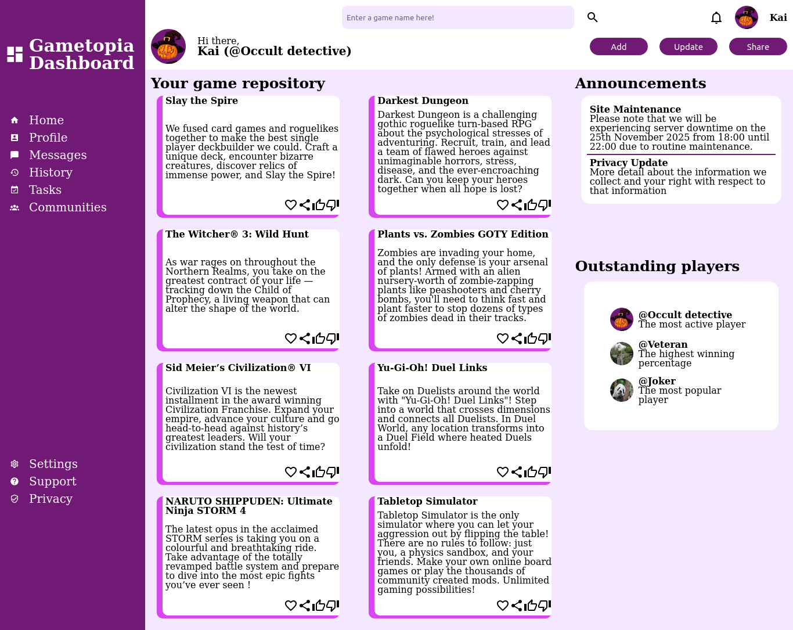

# odin_admin_dashboard

[Live preview](https://maxim55069633.github.io/7.odin_admin_dashboard/)

This project aims to practice my grid skills intensively based on the given 2-dimension layout (Odin project sample). I also learn the following things:
1. How to leverage online resource to improve development efficiency? E.g: Check color palettes from Tailwind. Download icons and svg images from Material Design Icons.
2. How to create a circle, put the user's avatar into it and resize?
3. How to capture the entire webpage using Firefox's console toolbox?

This is the grid sample from the odin project:

This is my solution:

Attribution:
All the game descriptions come from their corresponding game introduction on STEAM.
images:
1.
Pumpkin from OpenClipart-Vectors on Pixabay
https://pixabay.com/vectors/halloween-pumpkin-scary-spooky-1298060/
2.
Starwman from beatroot_fsu on Pixabay
https://pixabay.com/photos/farm-scarecrow-strawman-bird-scarer-6836096/
3.
Panda from Cimberley on Pixabay
https://pixabay.com/photos/animal-panda-mammal-species-fauna-1236875/

